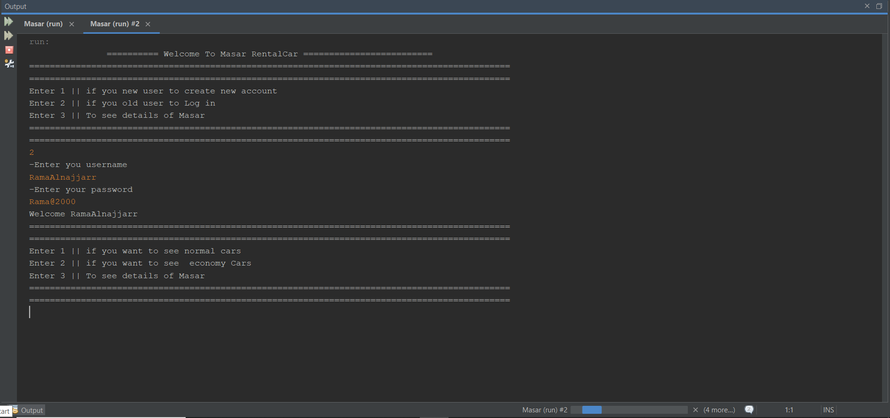
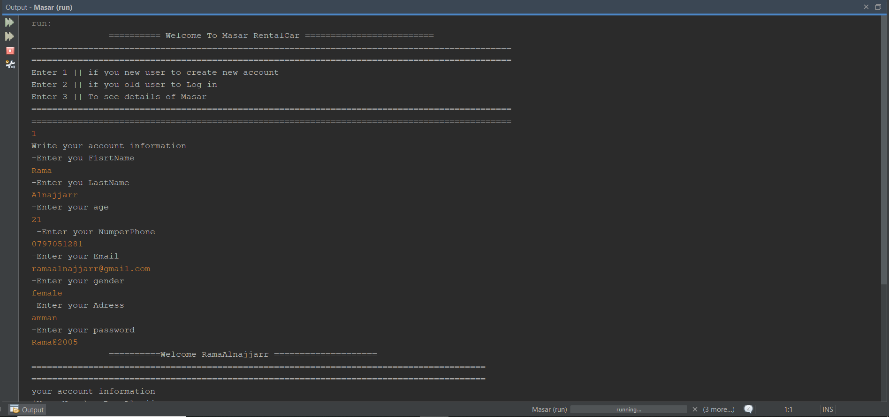
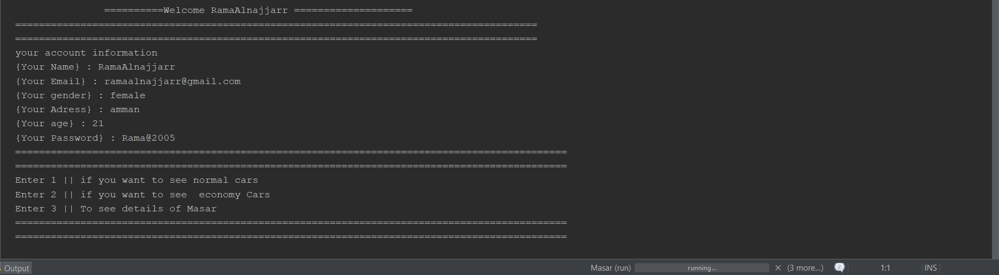
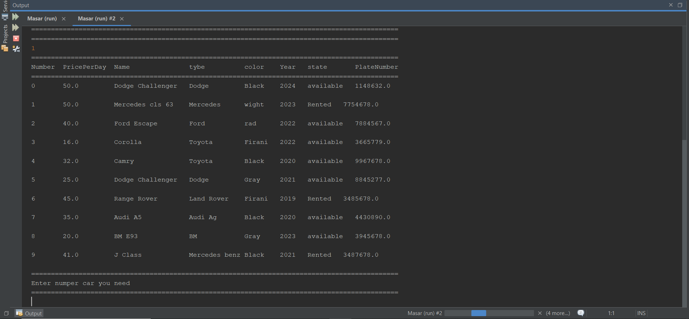
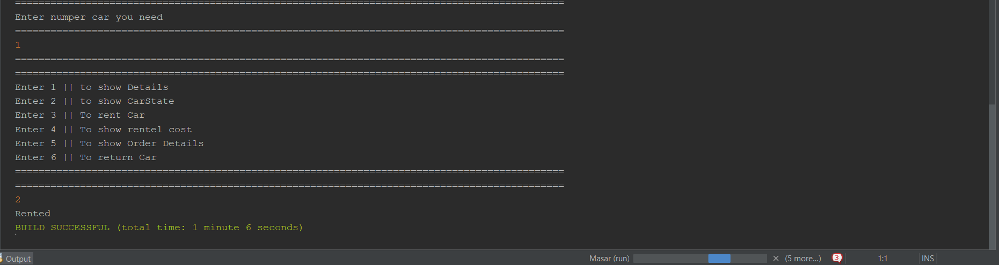
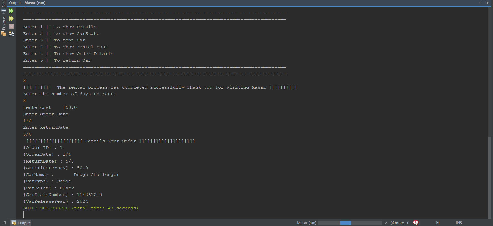

# 🚗 Masar Car Rental System

## 📌 Overview

Masar Car Rental System is a Java-based car rental application developed using NetBeans.

The system allows users to create accounts, log in, view available cars, rent vehicles, manage rental information, and return cars.

---

## ✨ Features

- User Registration
- User Login
- Account Management
- View Available Cars
- Car Rental Process
- Rental Status Management
- Return Cars

---

## 🛠 Technologies Used

- Java
- Object-Oriented Programming (OOP)
- NetBeans IDE

---

## 📸 Screenshots

### 🔐 Login Screen



---

### 📝 Sign In Screen



---

### 👤 Account Information



---

### 🚗 Car List



---

### 📋 Car State



---

### 🚙 Rental Process



---
## 🚀 How to Run the Project

### Requirements

Before running the project, make sure you have:

- Java JDK installed
- NetBeans IDE installed

### Steps

1. Clone the repository using Git:

```bash
git clone https://github.com/ramaalnajjarr2/Masar-Car-Rental-System.git
```

2. Open the project using NetBeans:

```
File → Open Project → Select Masar-Car-Rental-System
```

3. Run the project from NetBeans.

### Alternative Method

You can also download the project as a ZIP file:

```
GitHub → Code → Download ZIP
```

Then extract the folder and open the project using NetBeans.
## 🎯 Purpose

This project was developed to practice Java programming concepts and Object-Oriented Programming principles.
